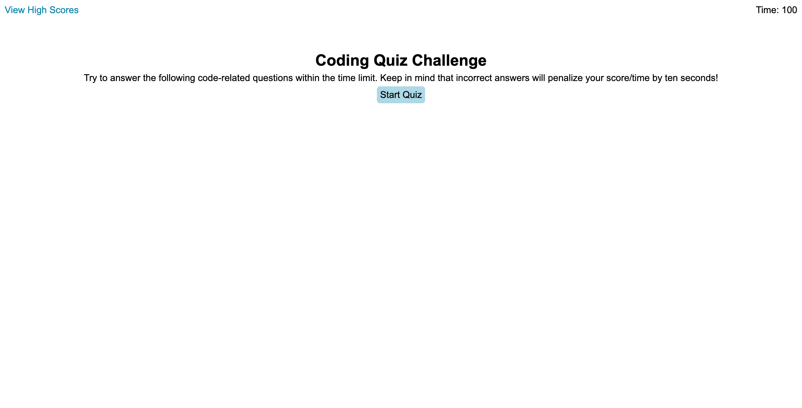

# Javascript Quiz
## Table of contents

- [Overview](#overview)
  - [The challenge](#the-challenge)
  - [User Story](#user-story)
  - [Acceptance Criteria](#acceptance-criteria)
  - [Screenshot](#screenshot)
  - [Links](#links)
- [My process](#my-process)
  - [Built with](#built-with)
  - [What I learned](#what-i-learned)
  - [Continued development](#continued-development)
  - [Useful resources](#useful-resources)
- [Author](#author)

## Overview

### The challenge

The challenge of this assignment is to create a webpage that quizzes the user on javascript using a timer and local storage to store high scores.

### User Story

AS A coding boot camp student  
I WANT to take a timed quiz on JavaScript fundamentals that stores high scores  
SO THAT I can gauge my progress compared to my peers  

### Acceptance Criteria

GIVEN I am taking a code quiz  
WHEN I click the start button  
THEN a timer starts and I am presented with a question  
WHEN I answer a question  
THEN I am presented with another question  
WHEN I answer a question incorrectly  
THEN time is subtracted from the clock  
WHEN all questions are answered or the timer reaches 0  
THEN the game is over  
WHEN the game is over  
THEN I can save my initials and score  

### Screenshot

### Links

- Solution URL: [https://github.com/ayeh6/Javascript-Quiz/](https://github.com/ayeh6/Javascript-Quiz/)
- Live Site URL: [https://ayeh6.github.io/Javascript-Quiz/](https://ayeh6.github.io/Javascript-Quiz/)

## My process

### Built with

- HTML
- CSS
- Javascript

### What I learned

What I learned building this application is how to create a dynamic site using the display property in CSS. By creating different div elements that are stacked on top of each other, I can use the display: none property to hide divs I don't need on screen and can show divs that are needed on screen. This is also handy because I can change the elements on the page before displaying them.

Other than that, it was a lot of Javascript logic to have the page functional. Multiple functions and listeners, also utilized jQuery to clear and append elements easily. I even created a way to randomize the choices and questions using an array that is initially in order, then randomize using the sort function along with the Math random function.

As for storing into local storage, it was just a null check if there are no scores stored, and using jQuery to clear and re-append elements onto the list on screen.

Lastly, for the questions I manually created a json file that has different questions with choices within each question, first choice being the correct one.

### Continued development

As for continued development, I would like to have more questions added to the quiz, and maybe even have some questions show and some not depending on randomization.

### Useful resources

- [W3Schools](https://www.w3schools.com/) - W3Schools helped a lot in general with certain jQuery functions that weren't taught in class, but were useful for the assignment.

## Author

- Website - [Andrew Yeh](https://ayeh6.github.io/Yeh-Andrew-Portfolio-Website/)
- LinkedIn - [/in/ayeh6](https://www.linkedin.com/in/ayeh6/)
